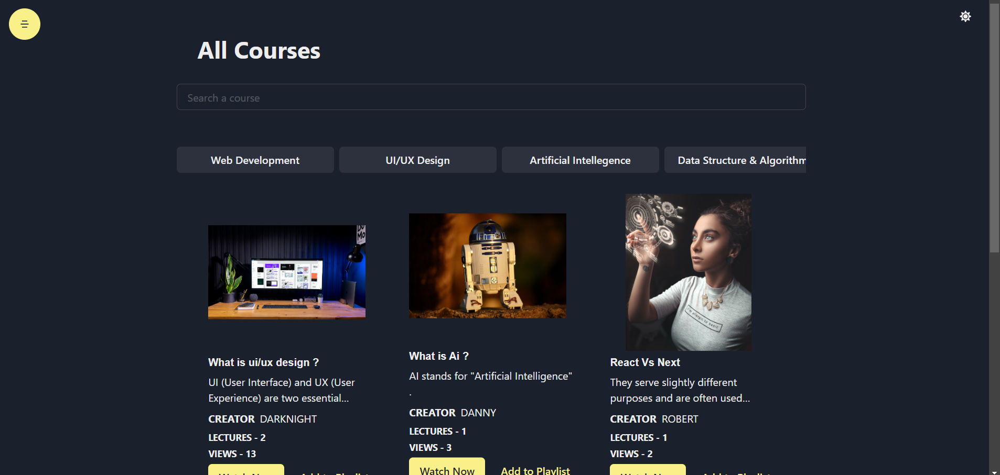

# LMS Project

The platform can be used by users to view courses upon their interest. Admin can add multiple courses using this platform.

## Table of Contents

- [Project Features](#project-features)
- [Tech Stack](#tech-stack)
- [Backend Libraries Used](#backend-libraries-used)
- [Setup and Installation](#setup-and-installation)
- [Environment Variables](#environment-variables)
- [Development Choices](#development-choices)
- [Deployment](#deployment)

---

## Project Features

- **Authentication**: Implement secure user authentication using JWT
- **Admin**: Admin can add courses
- **Course Viewing**: Users can view courses subscribing them

---

## Tech Stack

- **Backend**: NodeJs, Express, Javascript
- **Database**: Mongodb
- **Frontend**: React, Javascript, Redux

---

## Backend Libraries Used

- **dotenv**: Loads environment variables from `.env` file.
- **express**: Fast, minimal web server framework.
- **nodemon**: Automatically restarts server on file changes..
- **jsonwebtoken**: Implement authentication and role based access control

---

## Setup and Installation

### Prerequisites

- NodeJS
- Mongodb

### Environment Variables

- Create a `.env` file in the backend directory and copy the content from `.env.example` into it.
- Get Postgres and Redis Dtabase url

### Steps

1. **Clone the Repository**:
   ```bash
   git clone https://github.com/ayushjaiz/LMS-project
   cd LMS-project
   ```
2. **Run the Backend Application:**
   ```bash
   npm install
   npm run build
   npm run start
   ```
3. **Run the Frontend Application:**
   ```bash
   npm install
   npm run start
   ```

---

## Development Choices

### Why Node.js?

- Excellent package ecosystem
- Strong async/await support
- Easy deployment options

### Why React

- Virtual DOM Support
- Components can be reused

---

## Acknowledgements

This project was completed with the assistance of various online resources. I utilized the following tools and sources to support the development of this application:

- Google + Stack Overflow - for bugs and documentation of libraries
- mongo db docs

## Images

HERO page


Courses page



Registeration Page


